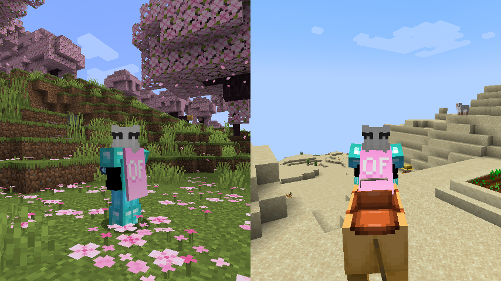

# Kappa

A Fabric mod that enables OptiFine's capes on snapshots.
Licensed under Unlicense.
Made by Hibi.

**Notice**: This mod does **not** replace OptiFine nor lets non-donors to wear them.
It merely adds the OptiFine capes and displays them, if you have donated to OptiFine.
If you enjoy OptiFine and want a cape, [consider donating to OF.][1]

Usually Fabric mods are compatible between versions, but sometimes, like in the 1.17 snapshots, Minecraft itself breaks the mods.
I will test my mod against the latest snapshot, because I like playing with my OptiFine cape, so if my mod is broken, I will update it.
When a version of Kappa is compatible with the newest snapshot, I will not rerelease it, but I'll certify it for working in said snapshot.
You will know you when to update the mod when it's broken in the latest snapshot.

The difference between [Drago's Capes][2] and even [Colher's Capes][3] is that Kappa does not register its own cape and elytra features.
Effectively what those do is *duplicating* the cape, they *clone* the cape code (which is more work to maintain).
However, I want capes in snapshots, so the smallest codebase is the best because it's the easier to maintain.
Effectively what Kappa does is inject OptiFine capes into the game: any mods that affect the vanilla cape will also affect the OptiFine cape.

Yes, OptiFine's cape breaks Minecraft's commercial usage guidelines, but I already had it for lots longer. I consider it part of my skin.

**On Quilt support:** This mod sits in a gray area, as thus is probably safe to avoid if you're using Quilt. However, Kappa uses as little Fabric specific components as possible.

---

Source: https://github.com/Hibiii/Kappa \
Discord: https://discord.gg/Zef3c27dN2

[1]: https://optifine.net/donate
[2]: https://www.curseforge.com/minecraft/mc-mods/of-capes
[3]: https://www.curseforge.com/minecraft/mc-mods/capes
